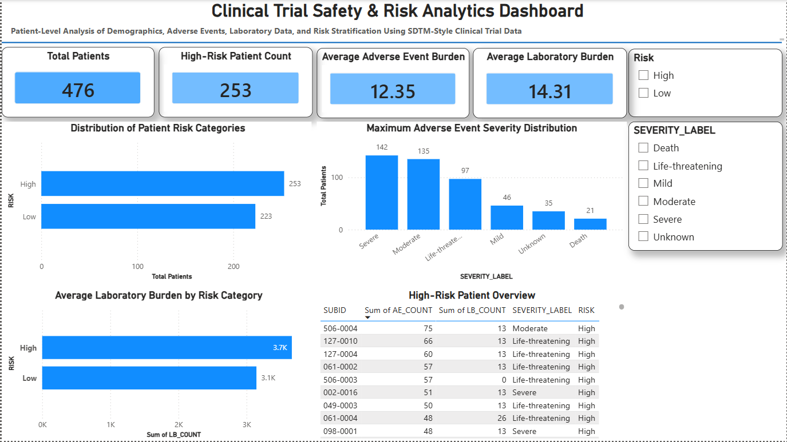

# 🧪 Clinical Trial Safety & Risk Analytics Project

## 📌 Project Overview
This project is an end-to-end Clinical Data Management (CDM) and analytics pipeline built using SDTM-style clinical trial datasets from a prostate cancer study.

It focuses on transforming raw clinical data into structured, analysis-ready datasets and generating patient-level insights for safety and risk evaluation.

---

## 🎯 Objective
To simulate real-world clinical trial data workflows by:
- Cleaning and standardizing SDTM-like datasets
- Performing patient-level integration
- Analyzing adverse events and laboratory data
- Building a risk stratification model
- Creating an interactive dashboard for insights

---

## 📊 Datasets Used
- **DM** – Demographics (Patient baseline data)
- **AE** – Adverse Events (Safety data)
- **LB** – Laboratory Results
- **EX** – Exposure data (treatment administration)

---

## 🛠️ Tools & Technologies
- Python (Pandas)
- SQL
- :contentReference[oaicite:0]{index=0}
- Jupyter Notebook
- Git & GitHub

---

## 🔄 Project Workflow

### 1. Data Cleaning
- Handled missing values
- Decoded categorical variables (SEX, RACE, etc.)
- Standardized formats

### 2. SDTM-style Structuring
- Organized datasets into CDISC-like domains
- Ensured consistent subject-level identifiers (SUBID)

### 3. Data Integration
- Merged DM, AE, LB datasets at patient level
- Derived AE and laboratory burden metrics

### 4. Risk Analysis
- Built risk categories based on:
  - AE frequency
  - Maximum AE severity
  - Lab burden

### 5. SQL Analysis
- Performed clinical queries for:
  - High-risk patients
  - Severity distribution
  - Laboratory trends

### 6. Dashboard Development
- Built interactive Power BI dashboard for visualization of:
  - Risk stratification
  - AE severity distribution
  - Patient-level summaries

---

## 📈 Key Insights
- Patients with higher AE counts showed increased laboratory burden
- Risk stratification successfully identified high-risk patient groups
- SDTM-style structuring improved data consistency and traceability

---

## 📊 Dashboard Preview

- Clinical Overview Dashboard
- Risk Distribution Analysis
- AE Severity Analysis
- SQL Query Outputs

---

## 💡 Skills Demonstrated
- Clinical Data Management (CDM)
- SDTM mapping concepts
- Data cleaning & preprocessing
- SQL querying & analysis
- Data visualization & storytelling
- Healthcare analytics

---

## 🚀 Future Improvements
- Survival analysis (time-to-event modeling)
- Predictive modeling for adverse events
- Automation of SDTM mapping pipeline
- Integration with real-world evidence (RWE) datasets

---

## 👨‍💻 Author
**Dharma Reddy Padala**

Healthcare Data Analyst | Clinical Data Enthusiast | Python | SQL | Power BI
